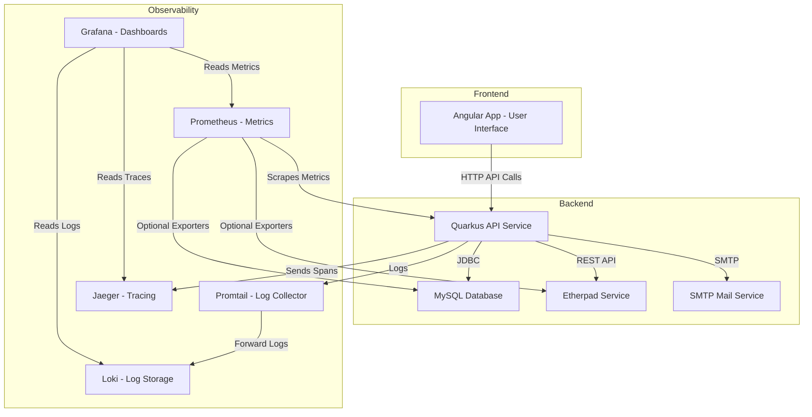

# Logging Tracing Monitoring Observability for doodle

In this project, we will perform logging, tracing, monitoring and observability for doodle, a microservices based web app, an important component in the devops cycle.


We might ask why is this important and how can it be useful in software development cycle ?

Actually, performing logging, tracing, monitoring, and observability for an app means setting up the tooling, pipelines, and practices to make sure we can track, debug, and improve the performance, reliability, and user experience of the app — across all its microservices.

First, you need to clone this repository internally, then open three terminals  : 
<ul>
  <li>one for the front : you run npm start </li>
  <li>one to launch the docker compose file docker compose up  </li>
  <li>one for the API calls that hold everything together **./mvnw quarkus:dev**  </li>
</ul>

By doing this you have a ready microservices-based web app 

## App architecture


Before setting up the tools to perform any of the above tasks, it is helpful to spend sometime understandig the architecture of our app.  
In the diagram below, we have a visualization of the app architecture and the tools we will be using.





## Logging


## Monitoring

Analyzing the pom.xml in the api folder, we can notice the presence of many dependencies and quarkus framework modules used to build the project backend.
By visiting :8080/q/metrics, we see many of the metrics

We will use Prometheus and Grafana to monitor the following aspects of app.


### ⚙ **2️⃣ Choose the Monitoring Tools**

Here’s what fits your stack:

| **Layer**       | **Tool**                                                                        |
| --------------- | ------------------------------------------------------------------------------- |
| Metrics         | Prometheus + Node Exporter, cAdvisor                                            |
| Service Metrics | Micrometer (if Java/Quarkus), MySQL Exporter, Blackbox Exporter (for endpoints) |
| Logs            | Loki (Grafana stack) or ELK                                                     |
| Tracing         | OpenTelemetry + Jaeger / Tempo                                                  |
| Dashboards      | Grafana                                                                         |

---


✅ **Prometheus** → scrapes metrics from :8080/q/metrics  
Those metrics are generated by MicroProfile Metrics enabled by this dependency in pom.xml

```
<dependency>
  <groupId>io.quarkus</groupId>
  <artifactId>quarkus-smallrye-metrics</artifactId>
</dependency>
```


✅ **Grafana** → visualizes reads from Prometheus and provides a dashboard to visualize those metrics


---

### 📦 **Configure prometheus and grafana**

Add this to docker-compose.yml 
after restarting the containers, you can visit grafana via :3000 port and prometheus via :9090 port

```yaml
services:
   prometheus:
    image: prom/prometheus
    ports:
      - "9090:9090"
    volumes:
      - ./prometheus.yml:/etc/prometheus/prometheus.yml

  grafana:
    image: grafana/grafana
    ports:
      - "3000:3000"
```

---

Then define a file (`prometheus.yml`) in /api, this allows for prometheus to read from /q/metrics endpoint
Prometheus Configuration 

```yaml
global:
  scrape_interval: 15s

scrape_configs:
  - job_name: 'quarkus-app'
    metrics_path: '/q/metrics'
    static_configs:
      - targets: ['host.docker.internal:8080']
```

> ⚠️ **Don't forget to enable prometheus metrics in application.yml by adding**
```
metrics:
    enabled: true
    export:
      prometheus:
        enabled: true
```

Now we need to connect grafana to prometheus via grafana interface, this video by Prometheus founder on Youtube was very helpful to solve a communication problem we had,
link to the video <a href="https://www.youtube.com/watch?v=EGgtJUjky8w" >Connect grafan to prometheus</a>

```error
Post "http://localhost:9090/api/v1/query": dial tcp 5.196.120.201:9090: connect: connection refused - There was an error returned querying the Prometheus API.
```

The solution was to put grafana and prometheus in the same docker network host ( can be seen in docker-compose.yml as **network_mode: "host"**)


## Metrics to track

Now that we have successfully set up prometheus and grafana, we can Monitor CPU, memory, threads, and garbage collection in real-time.

See HTTP request throughput, latency, and error rates.

Track database connection usage, query performance and more.

---

### 📊 **5️⃣ Grafana Dashboards**

* Connect Grafana to Prometheus (`http://prometheus:9090`)
* Import ready-made dashboards:

  * Node Exporter Dashboard (system metrics)
  * cAdvisor Dashboard (Docker/container metrics)
  * MySQL Overview Dashboard
* Set alerts for high CPU, memory, slow queries, service down, etc.

---

### 🔍 **6️⃣ Add Logging + Tracing (Optional Next Step)**

If you want **centralized logs**:

* Add **Loki** for log aggregation
* Configure containers to send logs (via Docker logging drivers or Promtail)

For **tracing**:

* Instrument Java/Quarkus services with OpenTelemetry SDK
* Run **Jaeger** or **Tempo** as a Docker service to collect and visualize traces

---

### 🚀 **Final Deployment**

After adding all these:

1. Run `docker compose up -d`
2. Access:

   * Prometheus: [http://localhost:9090](http://localhost:9090)
   * Grafana: [http://localhost:3000](http://localhost:3000) (default user: `admin` / `admin`)

---

Would you like me to generate the full `docker-compose.yml` file with all these monitoring services included, ready to deploy?


## Screenshots of used tools


## Tracing


## Observability