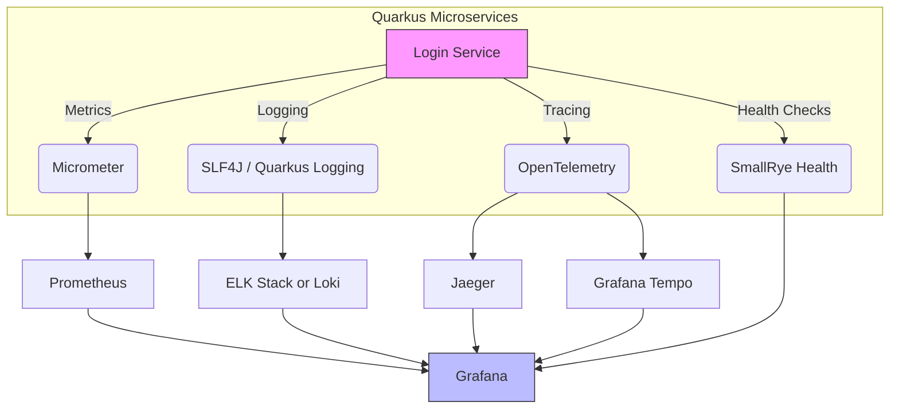

# Logging Tracing Monitoring Observability for doodle

In this project, we will perform logging, tracing, monitoring and observability for doodle, a microservices based web app

Here is a diagram to visualize the workflow

## Logging

## Tracing

## Monitoring

## Observability