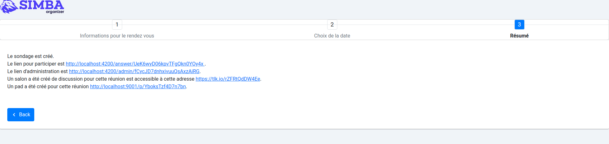

# Logging Tracing Monitoring Observability for doodle

In this project, we will perform logging, tracing, monitoring and observability for doodle (a microservices based web app) an important step in the devops cycle.


We might ask why is this important and how can it be useful in software development cycle ?

Actually, performing logging, tracing, monitoring, and observability for an app means setting up the tooling, pipelines, and practices to make sure we can track, debug, and improve the performance, reliability, and user experience of the app — across all its microservices.

First, you need to clone this repository internally, then open three terminals  : 

  1.one for the front : you run  **npm start** in /font  
  2.one to launch the docker compose file in /api:  **docker compose up**  
  3.one for the API calls that hold everything together **./mvnw quarkus:dev** in /api


By doing this you have a ready microservices-based web app 



## App architecture


Before setting up the tools to perform any of the above tasks, it is helpful to spend sometime understandig the architecture of our app.  
In the diagram below, we have a visualization of the app architecture and the tools we will be using.


## Monitoring : How is the system behaving?

Analyzing the pom.xml in the api folder, we can notice the presence of many dependencies and quarkus framework modules used to build the project backend.
By visiting :8080/q/metrics, we see many of the metrics that we can be tracked.
Here is a screenshot


✅ **Prometheus** → scrapes metrics from :8080/q/metrics  
Those metrics are generated by MicroProfile Metrics enabled by this quarkus dependency in pom.xml

```
<dependency>
  <groupId>io.quarkus</groupId>
  <artifactId>quarkus-smallrye-metrics</artifactId>
</dependency>
```


✅ **Grafana** → visualizes reads from Prometheus and provides a dashboard to visualize those metrics


---

### 📦 **Configuration of prometheus and grafana for our web app**

Add this to docker-compose.yml 
after restarting the containers, you can visit grafana via :3000 port and prometheus via :9090 port

```yaml
services:
   prometheus:
    image: prom/prometheus
    ports:
      - "9090:9090"
    volumes:
      - ./prometheus.yml:/etc/prometheus/prometheus.yml

  grafana:
    image: grafana/grafana
    ports:
      - "3000:3000"
```


Then define a file (`prometheus.yml`) in /api, this allows for prometheus to read from /q/metrics endpoint, and this code to it.
```yaml
global:
  scrape_interval: 15s

scrape_configs:
  - job_name: 'quarkus-app'
    metrics_path: '/q/metrics'
    static_configs:
      - targets: ['host.docker.internal:8080']
```

> ⚠️ **Don't forget to enable prometheus metrics in application.yml by adding**
```
metrics:
    enabled: true
    export:
      prometheus:
        enabled: true
```

For Grafana set up, you only need to add this docker image to your docker-compose.yml
```

```

After restarting the docker-compose, now we can see thos interfaces by visiting 
localhost:9090 for prometheus and localhost:3000 for grafana


Now we need to connect grafana to prometheus via grafana interface, this video by a Prometheus co-founder on Youtube was very helpful to solve a communication problem we had,
link to the video <a href="https://www.youtube.com/watch?v=EGgtJUjky8w" >Connect grafana to prometheus</a>

```error
Post "http://localhost:9090/api/v1/query": dial tcp 5.196.120.201:9090: connect: connection refused - There was an error returned querying the Prometheus API.
```

The solution was to put grafana and prometheus in the same docker network host ( can be seen in docker-compose.yml as **network_mode: "host"**)


## Metrics Overview

Now that we have successfully set up prometheus and grafana, we can track many useful metrics. We configured a dashboard in grafana-dashboard.json that we uploaded to grafana.


This dashboard provides real-time insights into the performance and health of our system by monitoring key JVM, CPU, memory, thread, and garbage collection metrics.


### 1. **JVM Process CPU Load**

* **Metric:** `base_cpu_processCpuLoad_percent`
* **Usefulness:** Shows the CPU usage of the Java process. High values may indicate heavy computation or inefficient code.
* **Alerts Help:** Detect runaway processes or performance degradation early.

### 2. **System CPU Load**

* **Metric:** `vendor_cpu_systemCpuLoad_percent`
* **Usefulness:** Indicates total system CPU load. Helps understand external resource contention.
* **Alerts Help:** Warn of host-level overloads that may affect application performance.

### 3. **System Load Average (1m)**

* **Metric:** `base_cpu_systemLoadAverage`
* **Usefulness:** Reflects the number of active processes over the last minute. Helps assess general system load.
* **Alerts Help:** Identify when the system is under excessive stress.

### 4. **JVM Uptime**

* **Metric:** `base_jvm_uptime_seconds`
* **Usefulness:** Shows JVM uptime. Useful for detecting unexpected restarts.
* **Alerts Help:** Alert on short uptimes to detect crash loops.


## Memory Metrics

### 5. **Heap Memory**

* **Metrics:** `base_memory_usedHeap_bytes`, `committedHeap_bytes`, `maxHeap_bytes`
* **Usefulness:** Tracks memory usage patterns and capacity.
* **Alerts Help:** Prevent `OutOfMemoryError` by alerting on high usage trends.

### 6. **Non-Heap Memory**

* **Metrics:** `vendor_memory_usedNonHeap_bytes`, `committedNonHeap_bytes`
* **Usefulness:** Monitors class metadata, code cache, etc.
* **Alerts Help:** Catch memory leaks outside the heap.

### 7. **Heap Memory Pools**

* **Metric:** `vendor_memoryPool_usage_bytes` (e.g., G1 Eden, Survivor, Old Gen)
* **Usefulness:** Detailed view into GC-managed memory areas.
* **Alerts Help:** Spot memory pressure before it causes GC issues.

### 8. **Non-Heap Memory Pools**

* **Metric:** `vendor_memoryPool_usage_bytes` (e.g., Metaspace, CodeCache)
* **Usefulness:** Helps tune JVM settings like Metaspace size.
* **Alerts Help:** Avoid class loader memory leaks.

### 9. **Heap Usage Percentage**

* **Metric:** `100 * (usedHeap / maxHeap)`
* **Usefulness:** Percent-based view of heap consumption.
* **Alerts Help:** Simple threshold alerts on memory saturation.

### 10. **System Memory**

* **Metrics:** `vendor_memory_freePhysicalSize_bytes`, `freeSwapSize_bytes`
* **Usefulness:** Provides insight into host machine memory resources.
* **Alerts Help:** Detect host-level memory exhaustion.

---

## Threads & Classloading

### 11. **Threads**

* **Metrics:** `base_thread_count`, `base_thread_daemon_count`, `base_thread_max_count`
* **Usefulness:** Monitors concurrency and resource usage.
* **Alerts Help:** Alert on thread leaks or spikes in thread count.

### 12. **Classloading**

* **Metrics:** `loadedClasses_count`, `total`, `unloaded`
* **Usefulness:** Tracks class loading/unloading dynamics.
* **Alerts Help:** Catch classloader-related issues or memory leaks.

---

## Garbage Collection

### 13. **GC Collection Count**

* **Metric:** `base_gc_total`
* **Usefulness:** Tracks how often GC is invoked.
* **Alerts Help:** Alert if GC frequency increases, indicating memory pressure.

### 14. **GC Collection Time**

* **Metric:** `base_gc_time_total_seconds`
* **Usefulness:** Measures total time spent on GC.
* **Alerts Help:** Long GC times may cause latency or downtime.

### 15. **GC Time per Collection**

* **Metric:** `gc_time_total / gc_total`
* **Usefulness:** Average cost of a GC run.
* **Alerts Help:** Identify inefficient GC configurations or memory problems.


---


These metrics are visualized in Grafana dashboards, which are configured using the `grafana-dashboard.json` file. The `expr` key in this JSON file contains the PromQL expressions used to query Prometheus for these metrics.

By monitoring these metrics, we can ensure the health, performance, and reliability of our application.

If there was a problem tracking those metrics, make sur the connection to prometheus is successful by visiting [localhost:9090/targets](http://localhost:9090/targets), and you need to get an up green state


You can even try to test some metrics directly on prometheus, like **vendor_cpu_processCpuTime_seconds**


Now have a ready dashboard,


Now a possible next step is to set up alerts, this could allow us to :  

  * Proactively detects anomalies before users are impacted.

  * Saves time on diagnostics by highlighting issues early.

  * Reduces downtime through automated notifications.

  * Improves system reliability by enabling fast incident response.

---


## Tracing : Why is the system behaving that way?


## Installation of Jaeger & OpenTracing :
### Adding a dependance in the pom/xml of doodle/api :
```xml
<dependency>
      <groupId>io.quarkus</groupId>
      <artifactId>quarkus-smallrye-opentracing</artifactId>
</dependency>
```
<br/>

### Configuration of Jaeger in our back-end :
In the : **src/main/resources/application.yml**, we add this :

```yml
quarkus:
  jaeger:
    service-name: doodle
    sampler-type: const
    sampler-param: 1
  log:
    console:
      format: '%d{HH:mm:ss} %-5p traceId=%X{traceId}, parentId=%X{parentId}, spanId=%X{spanId}, sampled=%X{sampled} [%c{2.}] (%t) %s%e%n'
```


* For the first parameter, if the service-name parameter is not provided, a no-op tracer will be configured, which will result in no tracing data being reported to the backend.
* Second, a constant sampler is used.
* Third, sampler-param is used to set the sampling of the requests. Here there is a sampling of all the queries as it is set to 1. This parameter can go from 0 to 1.
* And finally, we add trace IDs in the log message.

<br/><br/>

## Launch of Jaeger

To launch Jaeger (in docker) simply run :
```sh
$ docker run -p 5775:5775/udp -p 6831:6831/udp -p 6832:6832/udp -p 5778:5778 -p 16686:16686 -p 14268:14268 jaegertracing/all-in-one:latest
```

Finally go to: http://localhost:16686/ to open the Jaeger UI

<br/>

Then we test by creating a survey on doodle, then we trace the request,
here is a result on jaeger


At the top of the trace view, the **dot** represents when a request was made and how long it took to complete (i.e., time to response). Clicking on this dot allows us to dive into the corresponding **trace** for more detailed insights.

**Distributed tracing** is a technique that connects information from various units of work—often executed across different services, processes, or hosts—to reconstruct the **entire journey of a request** through a distributed system. This is especially valuable in service-oriented architectures like ours, where understanding the full flow of a request can reveal **serialization points, parallel execution**, and **latency sources**.

In this example, we can observe key details such as:

* The **HTTP method** used (e.g., `POST`)
* The **response code** received (e.g., `201 Created`)
* The **URL** endpoint that was hit
* The specific **method and class** in the codebase that handled the request

**Jaeger**, our tracing system, captures the execution of each individual request as it traverses the entire stack of microservices. Each execution path is recorded as a **trace**, which is made up of one or more **spans**.

A **span** in Jaeger represents a single unit of work within the trace. It includes:

* An **operation name** (e.g., `createUser`)
* A **start timestamp**
* A **duration**
  Spans can be **nested** or **sequenced** to model cause-and-effect relationships between operations, helping us visualize and understand the behavior of our system at a granular level.


## Logging : recording detailed, timestamped records of events

... to finish